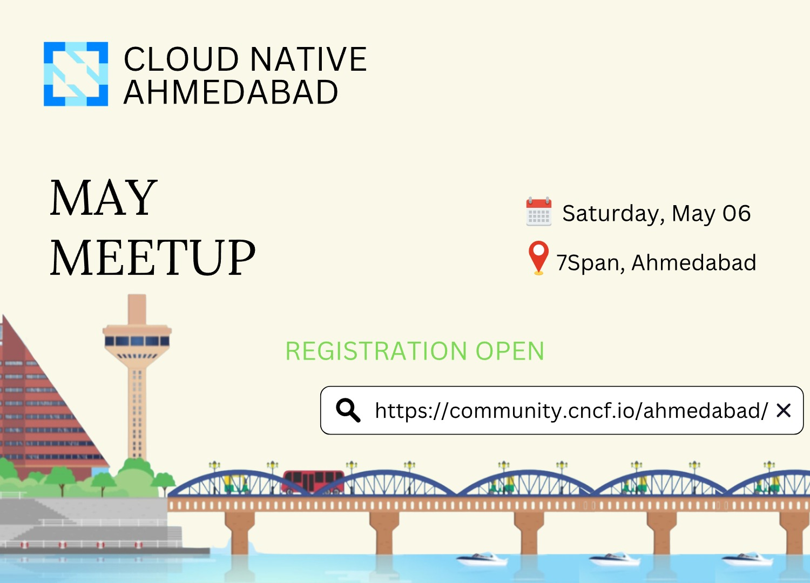
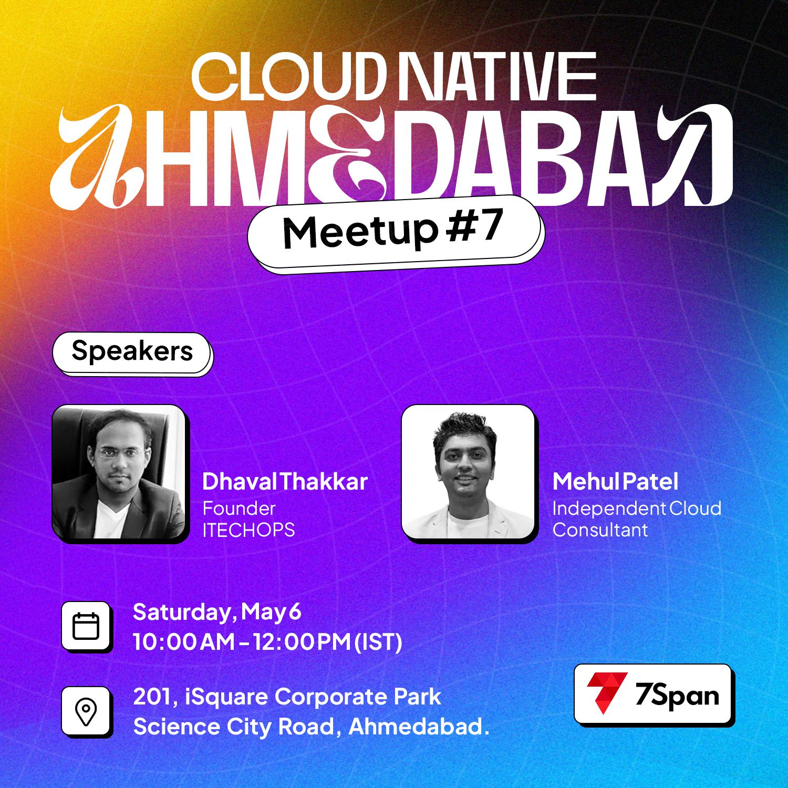

#CNCF Ahmedabad Meetup May'23

[Cloud Native Ahmedabad Meetup](https://community.cncf.io/events/details/cncf-ahmedabad-presents-cloud-native-ahmedabad-meetup-7/) chapter is organising a meetup to explore and spread the a word about various CNCF projects and cloud native technologies.

* Talk title : Google Kubernetes Engine 101: From Containers to Deployment
* Description : Join us to explore Google Kubernetes Engine (GKE) and learn how to create a container using Cloud Build and store it in Container Registry. Discover the features of Kubernetes and how GKE compares. We'll dive into Kubernetes architecture and show you how to deploy a Kubernetes cluster using GKE. You'll also learn how to deploy Pods to a GKE cluster and view and manage Kubernetes objects. By the end of the talk, you'll be ready to take your first steps into the world of GKE deployment!

     * Introduction
     * Introduction to Google Cloud
     * Introduction to Containers and Kubernetes
     * Kubernetes Architecture
     * Introduction to Kubernetes Workloads
     * Q&A

* Date: 06th May 2023 

### Goals : 

* Promote and Educate people about Latest Cloud trends like Docker, Kubernetes, GCP.  
* Learn about the different concepts that makes up scalable platfrom.  
* *Organizers* are accountable to clarify queries on the day of event. 

### Prerequisite 

* Open-Minded 

### Follow Me : 

Feel free to ping me anytime on [Telegram](http://telegram.me/nomadicmehul) or [Twitter](http://twitter.com/nomadicmehul) and I’m happy to chat with you.

For any queries raise a [issue](hhttps://github.com/nomadicmehul/CNCF-Ahm-Meetup-May-23/issues) and please feel free to submit a PR anytime :)

